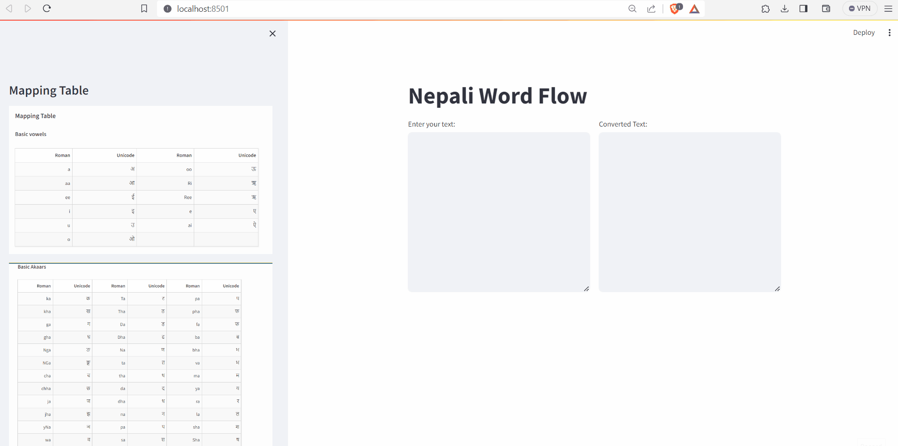

## About

In the era of artificial intelligence and natural language processing, the "Nepali Word Flow" app leverages machine learning to predict subsequent words in a given sequence. The application aims to enhance writing cohesion and flow by providing a user-friendly web experience developed with Streamlit. This project incorporates a predictive model with LSTM architecture, Nepali Unicode support, and model loading and persistence for efficient usage. The proposed solution targets increased productivity, better writing experiences, and educational value.

## Problem Statement

In our daily online activities, we often rely on platforms like Google, which offer predictive suggestions as we type in the search bar. This convenience extends to various web applications such as Grammarly, QuillBot, TextBlaze, and PhraseExpress, among others, predominantly designed for English language users. However, when it comes to technical writing in Nepali—especially in sectors like government offices and Nepali newspapers—such tools are noticeably absent.

While there are a few existing Nepali applications offering next-word suggestions, they cater primarily to mobile phone users and are suited for casual chatting. Writing lengthy texts on a small mobile screen can be cumbersome, and the process of downloading, installing, and then using these applications may deter users who prefer instant solutions in today’s fast-paced digital landscape. Additionally, there are some web applications allowing instant access, but they are limited to converting romanized text into Nepali script.

Identifying this gap, I envisioned a solution: the Nepali Word Flow application. In this innovative approach, users input text in roman format, which is then seamlessly converted to Nepali script. Based on this input, the application intelligently suggests the next five words, bridging the gap for efficient and user-friendly Nepali language processing in various professional domains.

## How to Run

### Prerequisites

Make sure you have the following prerequisites installed:

- Python 3.9
- TensorFlow 2.15.0
- Keras 2.6.0
- Streamlit 1.29.0

Install additional dependencies listed in `requirements.txt`:

- pip install -r requirements.txt

### For Jupyter Notebook

1. Open the `notebooks/` folder.
2. Run `nwp_nepali.ipynb` in a Jupyter notebook environment.

### For Streamlit App

1. Open the `src/` folder.
2. Run `streamlit run app.py` using Python.

## Dependencies
- `requirements.txt`: File containing dependencies and their versions.

## Additional Files

- `plot.png`: Plot image generated from the model.
- `01.PNG`, `02.PNG`, `03.PNG`: Images used in the Streamlit sidebar.
- `token.pkl`: Pickled tokenizer file.
- `next_words.h5`: Trained model file.
- `Demo.gif`: Animated demonstration of your project's features.

## Demo

